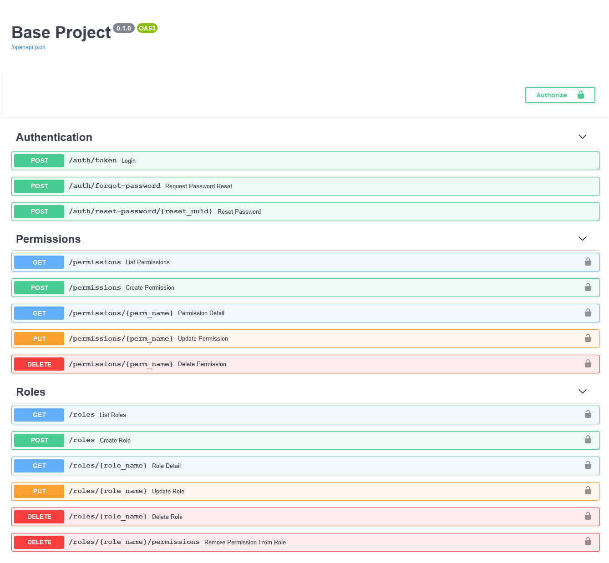
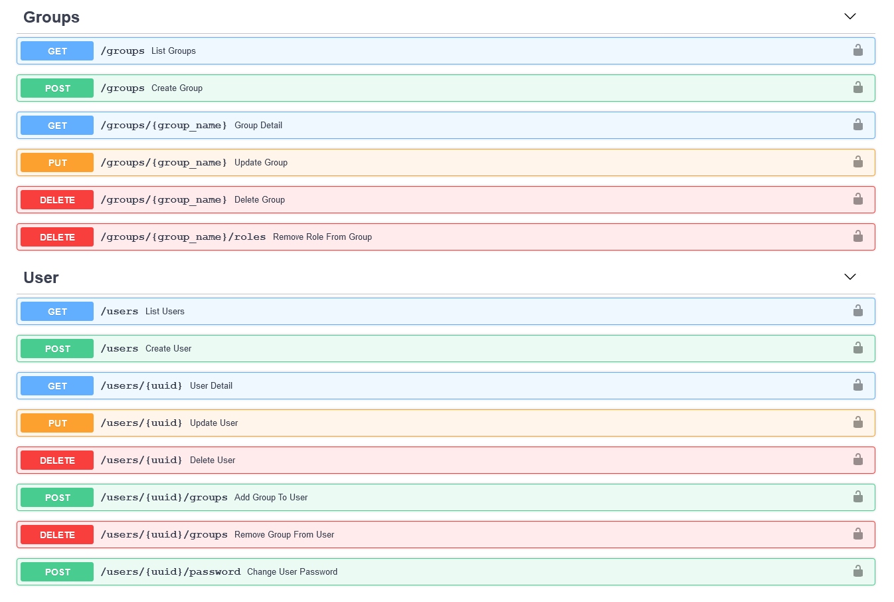

# FastAPI Project Template

Generate a FastAPI application backend with Role Based Access Control(RBAC) using Python, including interactive API documentation.

## Features

* **Production ready** Python web server using Uvicorn and Gunicorn.
* Everything that comes with [FastAPI](https://fastapi.tiangolo.com/features/)
    * **Fast:** Very high performance, on par with NodeJS and Go (thanks to Starlette and Pydantic).
    * **Intuitive:** Great editor support. Completion everywhere. Less time debugging.
    * **Easy:** Designed to be easy to use and learn. Less time reading docs.
    * **Short:** Minimize code duplication. Multiple features from each parameter declaration.
    * **Robust:** Get production-ready code. With automatic interactive documentation.
    * **Standards-based:** Based on (and fully compatible with) the open standards for APIs: OpenAPI and JSON Schema.
    * Many other features including automatic validation, serialization, interactive documentation, authentication with OAuth2 JWT tokens, etc.
* **RBAC:** Role Based Access Control
* **Secure password** hashing by default.
* **JWT** token authentication.
* **SQLAlchemy** models.
* **Alembic** migrations.
* **CORS** (Cross Origin Resource Sharing).
* Browse API docs offline
* Basic starting models for users (modify and remove as you need).
* Dependencies to check permission
* Initial data for admin User, permissions , roles, and group
* Dummy email for development

## How to use it

Go to the directory where you want to create your project and run:

```bash
pip install cookiecutter
cookiecutter https://github.com/Bexils/fastapi-project-template
```

### Generate passwords

You will be asked to provide secret key whic will be used for password hashing. Open another terminal and run:

```bash
openssl rand -hex 32
# Outputs something like: f5e601cffde98e116dab4e31c50764006c765295732d40a57dbebc02e273eeb1
```

If you're on Windows, run the command above on a WSL terminal or git bash.
Copy the contents and use that as password / secret key. And run that again to generate another secure key.


### Input variables

The generator (cookiecutter) will ask you for some data, you might want to have at hand before generating the project.

The input variables, with their default values (some auto generated) are:

* `project_name`: The name of the project
* `project_slug`: The development friendly name of the project. By default, based on the project name
* `secret_key`: Backend server secret key. Use the method above to generate it.
* `superuser_email`: The first superuser generated, with it you will be able to create more users, etc. By default, based on the domain.
* `superuser_password`: First superuser password. Use the method above to generate it or set a frendlier one.
* `db_host`: Database server url
* `db_port`: Database server port
* `db_name`: Name of database to use on the database server
* `db_engine`: Database server type, e.g postgres(default), mysql, e.t.c
* `db_user`: Database server user's username
* `db_password`: Database server user's password, use the method above to generate it or set a frendlier one.

## More details

After using this generator, your new project (the directory created) will contain an extensive `README.md` with instructions for development, deployment, etc. You can pre-read [the project `README.md` template here too](./{{cookiecutter.project_slug}}/README.md).

## Won't Do

This project does not intend to support any other ORM apart from SQLAlchemy unless it works as smoothly with pydantic as SQLAlchemy does.

## License

This project is licensed under the terms of the MIT license.

## Screenshots


